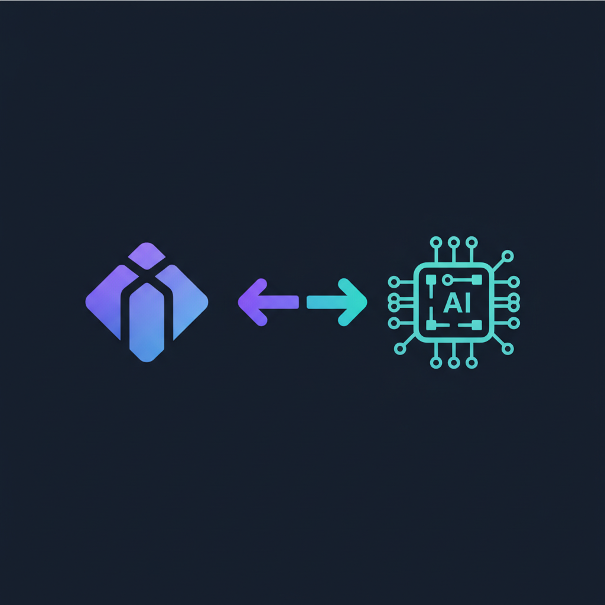

# figma-ui-mcp

<p align="center">
  
</p>

**Bidirectional Figma MCP** — use Claude (or any MCP client) to draw UI directly in Figma, and read existing designs back as structured data or code.

```
Claude ──figma_write──▶ MCP Server ──HTTP──▶ Figma Plugin ──▶ Figma Document
Claude ◀─figma_read──── MCP Server ◀─HTTP─── Figma Plugin ◀── Figma Document
```

---

## Features

| Direction | Tool | What it does |
|-----------|------|-------------|
| Write | `figma_write` | Draw frames, shapes, text on any page via JS code |
| Read  | `figma_read`  | Extract node trees, colors, typography, screenshots |
| Info  | `figma_status`| Check plugin connection status |
| Docs  | `figma_docs`  | Get full API reference + examples |

---

## Quick Start

### 1. Install the MCP server

**Via npx (recommended):**
```bash
claude mcp add figma-ui-mcp -- npx figma-ui-mcp
```

**Or clone and run locally:**
```bash
git clone https://github.com/TranHoaiHung/figma-ui-mcp
cd figma-ui-mcp
npm install
claude mcp add figma-ui-mcp -- node /path/to/figma-ui-mcp/server/index.js
```

### 2. Install the Figma plugin

1. Open **Figma Desktop**
2. Go to **Plugins → Development → Import plugin from manifest...**
3. Select `plugin/manifest.json` from this repo
4. Run **Plugins → Development → Figma UI MCP Bridge**

The plugin UI shows a green dot when the MCP server is connected.

### 3. Use with Claude

Start a new Claude Code session — the MCP tools are automatically available:

```
figma_status     — check connection
figma_write      — draw / modify UI
figma_read       — extract design data
figma_docs       — API reference
```

---

## Usage Examples

### Draw a screen

Ask Claude: *"Draw a dark dashboard with a sidebar, header, and 4 KPI cards"*

Claude calls `figma_write` with code like:

```js
await figma.createPage({ name: "Dashboard" });
await figma.setPage({ name: "Dashboard" });

const root = await figma.create({
  type: "FRAME", name: "Dashboard",
  x: 0, y: 0, width: 1440, height: 900,
  fill: "#0f172a",
});

const sidebar = await figma.create({
  type: "FRAME", name: "Sidebar",
  parentId: root.id,
  x: 0, y: 0, width: 240, height: 900,
  fill: "#1e293b", stroke: "#334155", strokeWeight: 1,
});

await figma.create({
  type: "TEXT", name: "App Name",
  parentId: sidebar.id,
  x: 20, y: 24, content: "My App",
  fontSize: 16, fontWeight: "SemiBold", fill: "#f8fafc",
});
// ... continue
```

### Read a design

Ask Claude: *"Read my selected frame and convert it to Tailwind CSS"*

Claude calls `figma_read` with `operation: "get_selection"`, receives the full node tree,
then generates corresponding code.

### Screenshot a frame

```
figma_read  →  operation: "screenshot"  →  nodeId: "123:456"
```

Returns a base64 PNG Claude can analyze and describe.

---

## Architecture

```
figma-ui-mcp/
├── server/
│   ├── index.js            MCP server (stdio transport)
│   ├── bridge-server.js    HTTP bridge on localhost:38451
│   ├── code-executor.js    VM sandbox — safe JS execution
│   ├── tool-definitions.js MCP tool schemas
│   └── api-docs.js         API reference text
└── plugin/
    ├── manifest.json       Figma plugin manifest
    ├── code.js             Plugin main — operation handlers
    └── ui.html             Plugin UI — HTTP polling + status
```

### Security

| Layer | Protection |
|-------|-----------|
| VM sandbox | `vm.runInContext()` — blocks `require`, `process`, `fs`, `fetch` |
| Localhost only | Bridge binds `127.0.0.1:38451`, never exposed to network |
| Operation allowlist | Only 20 predefined operations accepted |
| Timeout | 10s VM execution + 10s per plugin operation |
| Body size limit | 500 KB max per request |

---

## Available Write Operations (`figma_write`)

| Operation | Description |
|-----------|-------------|
| `figma.status()` | Current Figma context |
| `figma.listPages()` | List all pages |
| `figma.setPage({ name })` | Switch active page |
| `figma.createPage({ name })` | Add a new page |
| `figma.query({ type?, name?, id? })` | Find nodes |
| `figma.create({ type, ... })` | Create FRAME / RECTANGLE / ELLIPSE / LINE / TEXT |
| `figma.modify({ id, ... })` | Update node properties |
| `figma.delete({ id? name? })` | Remove a node |
| `figma.append({ parentId, childId })` | Move node into parent |
| `figma.listComponents()` | List all components |
| `figma.instantiate({ componentId, ... })` | Create component instance |

## Available Read Operations (`figma_read`)

| Operation | Description |
|-----------|-------------|
| `get_selection` | Full design tree of selected node(s) + design tokens |
| `get_design` | Full node tree for a specified frame or page |
| `get_page_nodes` | Top-level frames on the current page |
| `screenshot` | Export node as PNG (base64) |
| `export_svg` | Export node as SVG markup |

---

## Add to Other MCP Clients

**Claude Desktop** (`claude_desktop_config.json`):
```json
{
  "mcpServers": {
    "figma-ui-mcp": {
      "command": "npx",
      "args": ["figma-ui-mcp"]
    }
  }
}
```

**Cursor / VS Code:**
```json
{
  "mcp": {
    "servers": {
      "figma-ui-mcp": {
        "command": "npx",
        "args": ["figma-ui-mcp"]
      }
    }
  }
}
```

---

## License

MIT
